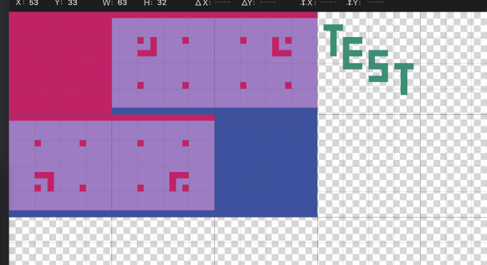
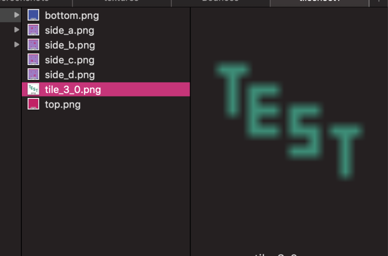

# tilesplit
CLI tilesheet splitter in Py3

#### usage: `python3 tilesplit.py tilesheet.png 16 tilesheet.txt`
 * takes in a tilesheet, the tile size, and the naming file
 * exports named tiles in a dir with the name of the tilesheet, in the same dir as the tilesheet

#### usage: `python3 tilesplit.py tilesheet.png 16`
 * takes in a tilesheet and the tile size
 * exports ***un***named tiles in the same location the above command would
 * exported files are named tile_x_y.png where x and y are the tile coordinate

#### usage `python3 tilesplit.py tilesheet.tsn`
 * takes in a tsn file
 * the tsn file must declare the image path (relative or absolute) and the tile size
 * exports files the same way the first option does

Files exported using the first or third way that were not given a name get a default name in the same format as files exported with the second way.

*tilesplit* uses Pathlib and has been used on Windows, but all testing is done on macOS. Additional testing on Windows as well as initial testing on Linuxes and even just on more devices would be appreciated. Please make an issue if you run into any problems running or otherwise using *tilesplit*



```
default _blank_
empty _noexport_
0 0 top
1 0 side_a
2 0 side_b
0 1 side_c
1 1 side_d
2 1 bottom
```


